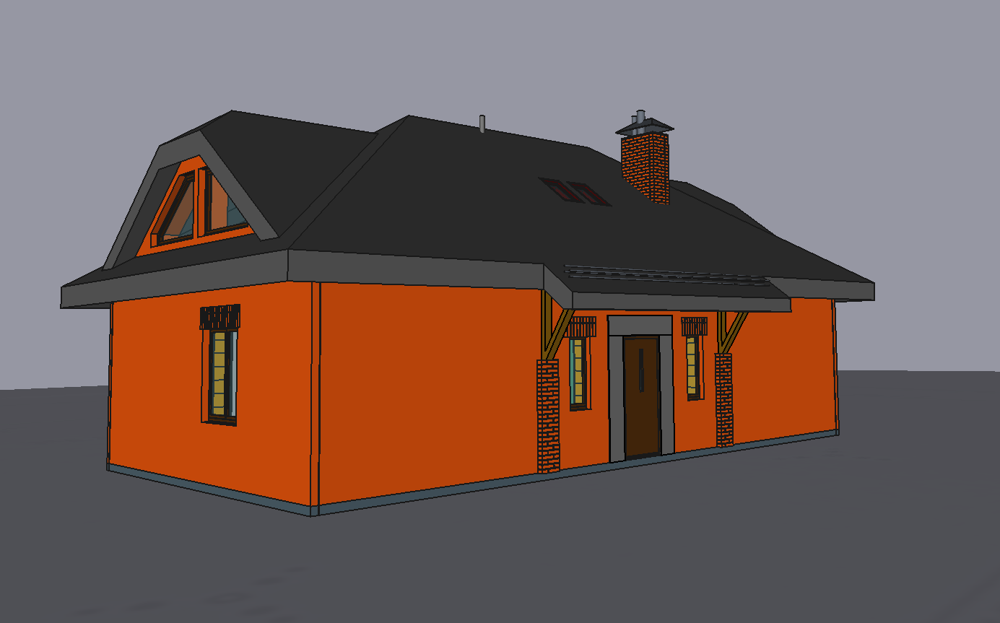
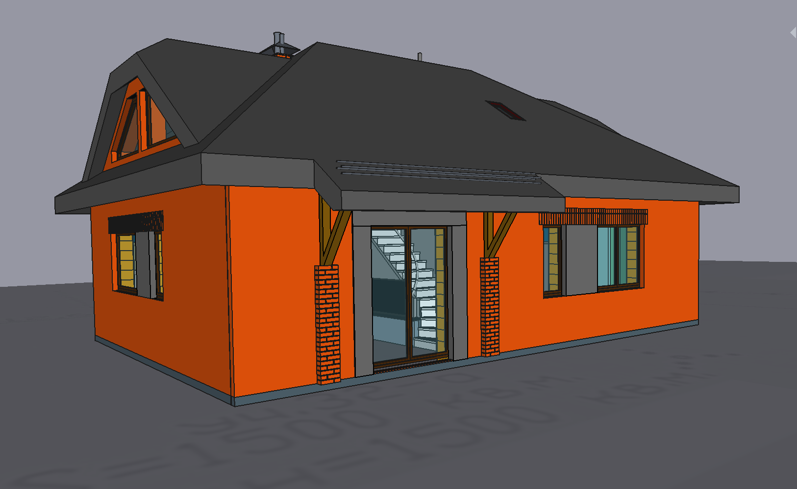

# 1.5 floor house (93m2 1st floor)
An open access project made with [freecad](https://www.freecadweb.org/?lang=ru) v0.19 (cc-by-nc-sa 4.0)

* 1.5 floor family house built from keramick blocks like "Poroterm 38".

