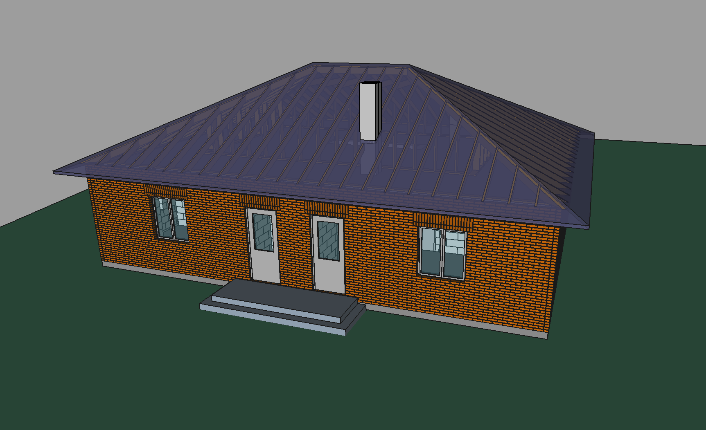

New project.
More comfortable, more room space. More XPS in the external wall for energy saving.

*brick blocks generation of the external wall disabled due the github file size limit. You can re-enable it by yourself.

* Not so small 135m2 1Fl. one-family house

