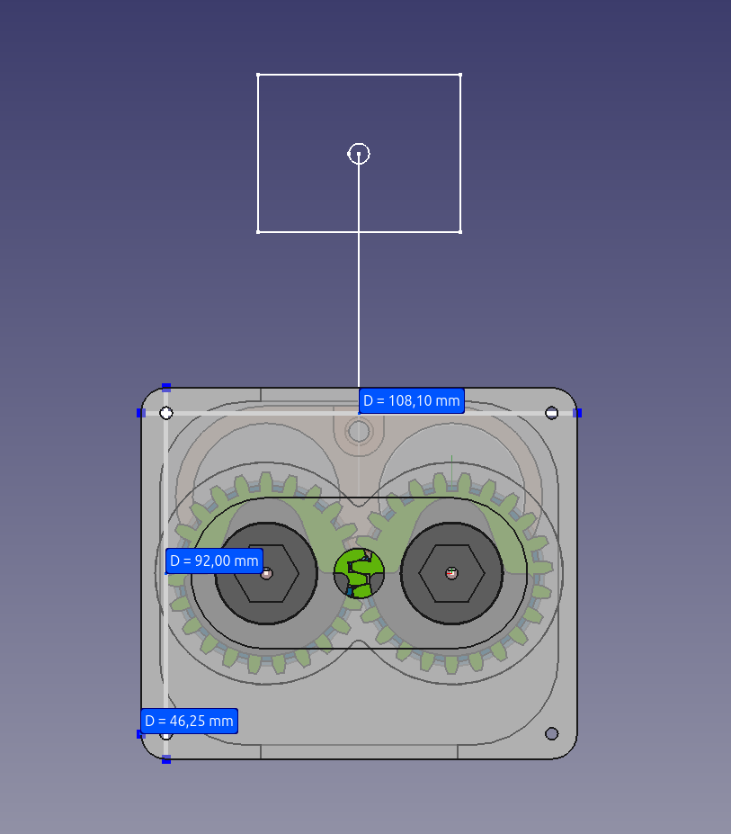
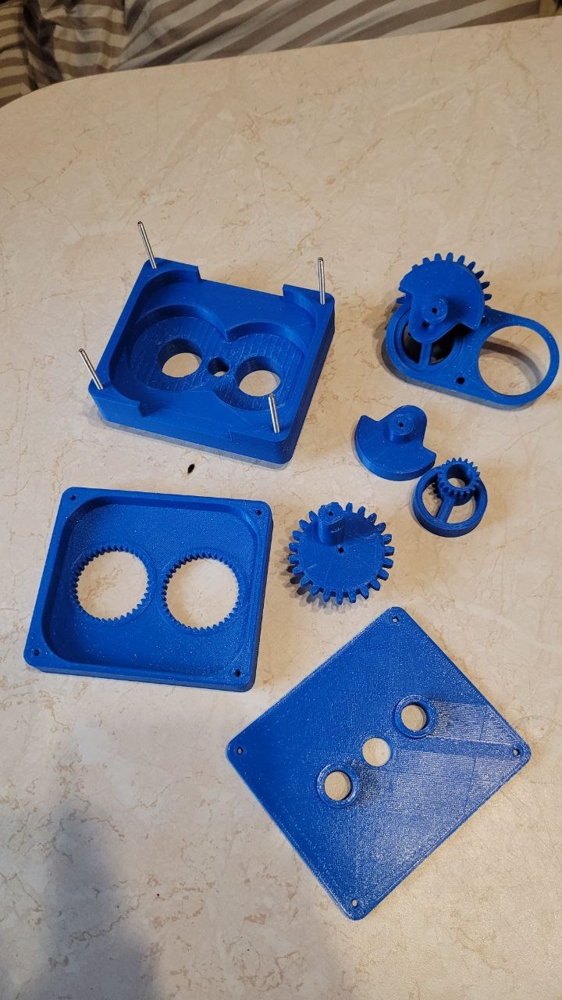
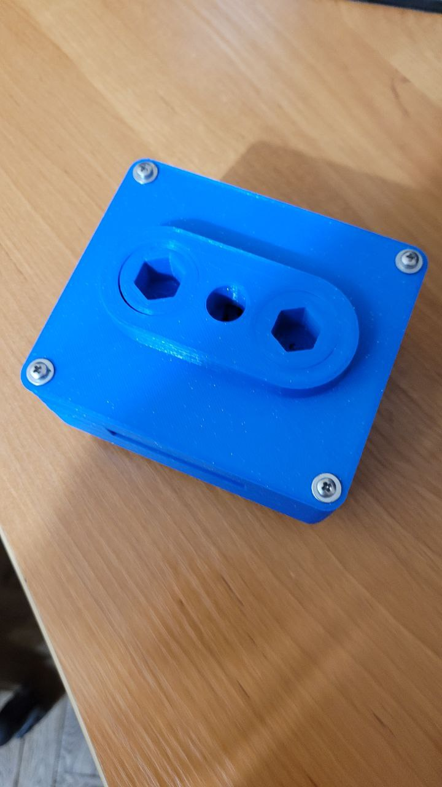

# "Paired at-Tusi engine" project - Crankless Engine mechanics
An open access project made with [freecad](https://www.freecadweb.org/?lang=ru) v0.21.2 for free use (cc-by-nc-sa 4.0)

Latest updates see at [REAA forum](https://reaa.ru/threads/sdvoyennyi-bshm-s-paroi-at-tusi-i-zubchatym-zatsepleniyem.114513/post-2264082)

"RusYoke" project - Crankless Engine mechanics
Video also available at YouTube:

[YouTube Video 1](https://www.youtube.com/watch?v=hZKsthMOHmc)
[YouTube Video 2](https://www.youtube.com/watch?v=s1Bi3JbBSQE)
[YouTube Video 3](https://www.youtube.com/watch?v=yXwV5SfdrLw)

