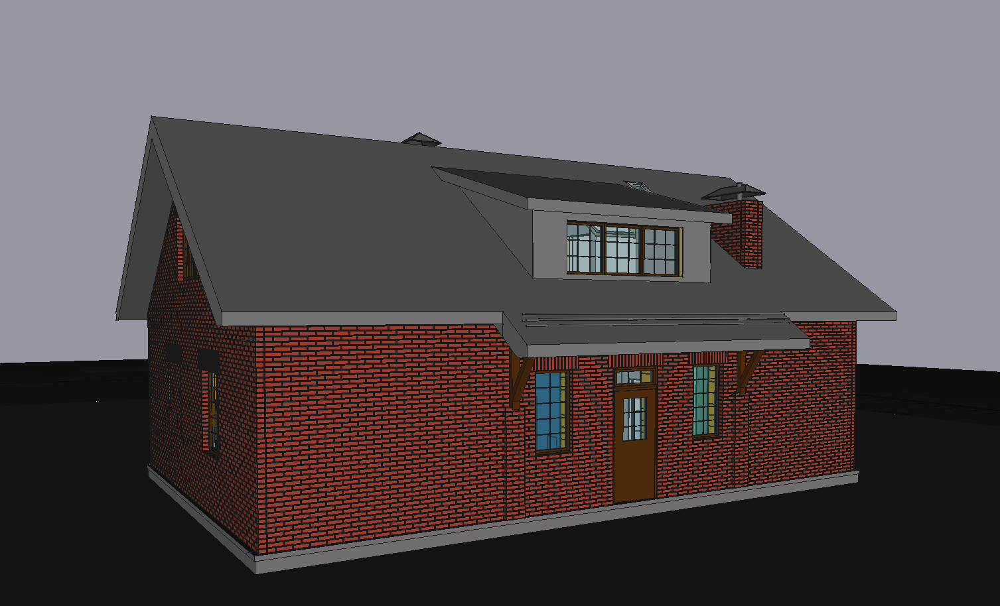
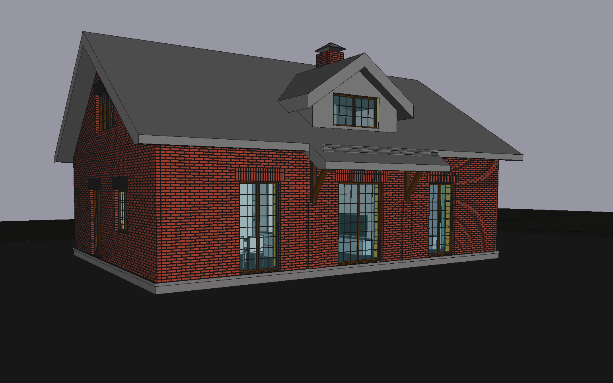

# freecad-projects
An open access projects made in [freecad](https://www.freecadweb.org/?lang=ru) (cc-by-nc-sa 4.0)

1.5 floor house (103m2 1st floor)
An open access project made with freecad v0.19 (cc-by-nc-sa 4.0)

Var.#1

Var.#2

* 1.5 floor family house built from keramick blocks like "Poroterm 38".
/sweet_home_3d-1.png)
/sweet_home_3d-2.png)
/2bedr_dev_010821_holland.FCStd)

* Very small 2.3mx4m bathhouse built from profiled wood beams (15x15cm).

