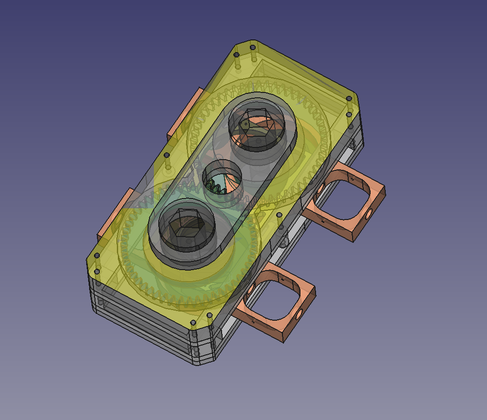
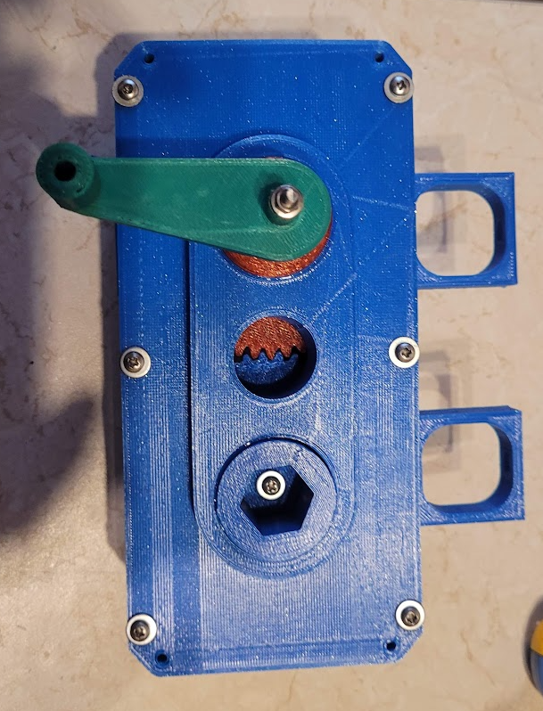

# "RusYoke" project - Crankless Engine mechanics
An open access project made with [freecad](https://www.freecadweb.org/?lang=ru) v0.21.2 (cc-by-nc-sa 4.0)

"RusYoke" project - Crankless Engine mechanics
Video at [YouTube]([https://www.freecadweb.org/?lang=ru](https://youtu.be/UqaibIIgE-4))

