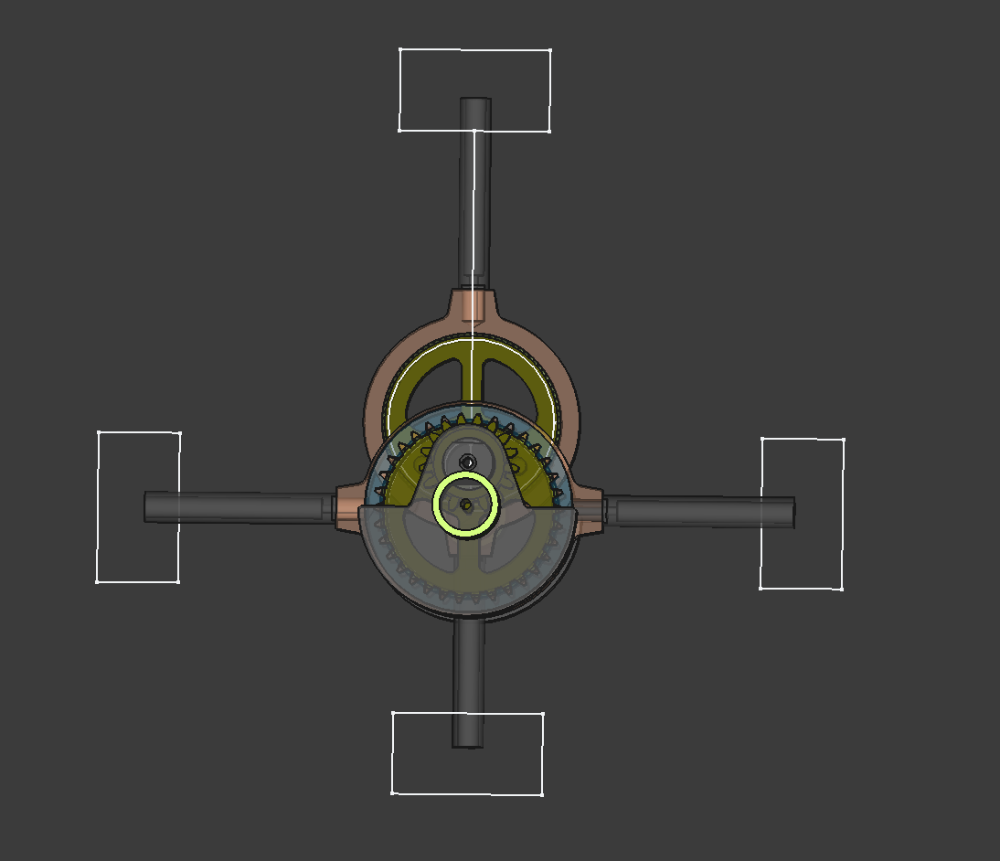
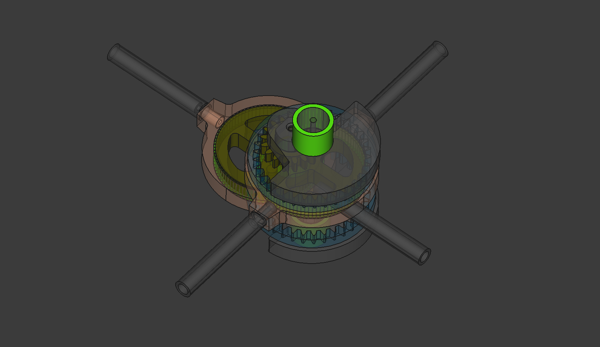

# "X-Shaped Stirling" project - Crankless Engine mechanics
An open access project made with [freecad](https://www.freecadweb.org/?lang=ru) v0.21.2 for free use (cc-by-nc-sa 4.0)

Latest updates see at [REAA forum](https://reaa.ru/threads/kh-obraznyi-stirling-s-bshm.114611/post-2266831)

"X-Shaped Stirling" project - Crankless Engine mechanics
Video also available at [YouTube](https://www.youtube.com/c/RomanMavrichev)

