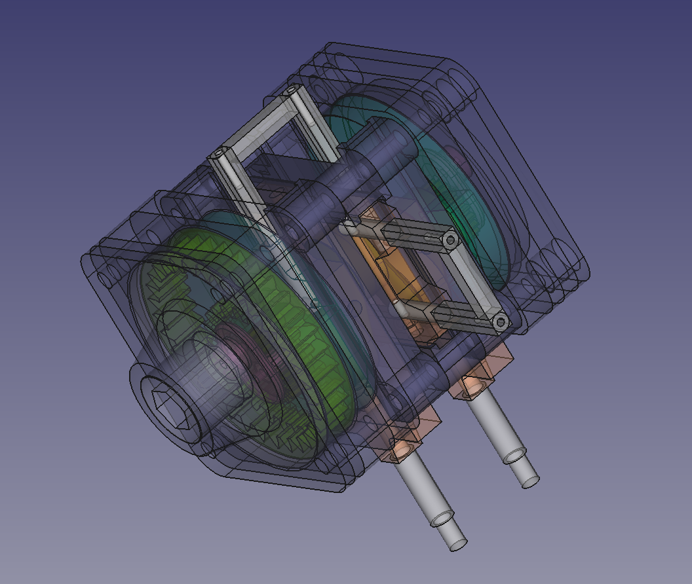
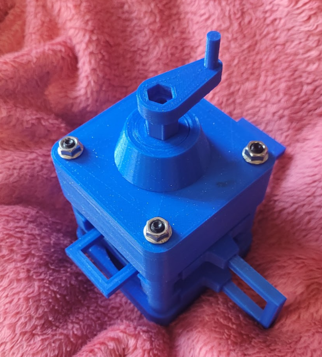

# "Crankless engine based on Sedunov design" project - Crankless Engine mechanics
An open access project made with [freecad](https://www.freecadweb.org/?lang=ru) v0.21.2 for free use (cc-by-nc-sa 4.0)

Latest updates see at [REAA forum]((https://reaa.ru/threads/besshatunnnyye-dvigateli-3.110868/post-2306030))

Video also available at RuTube:

[RuTube Video 1]((https://rutube.ru/shorts/72a507d803931d1667297087fe343829/))

