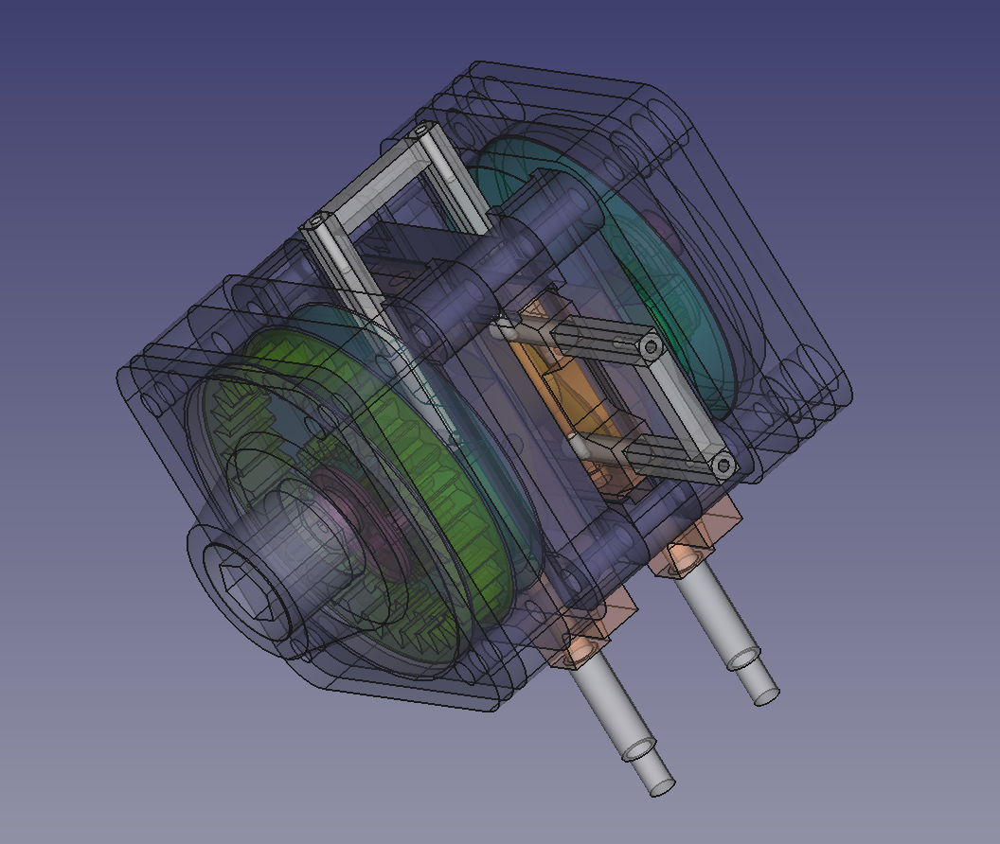
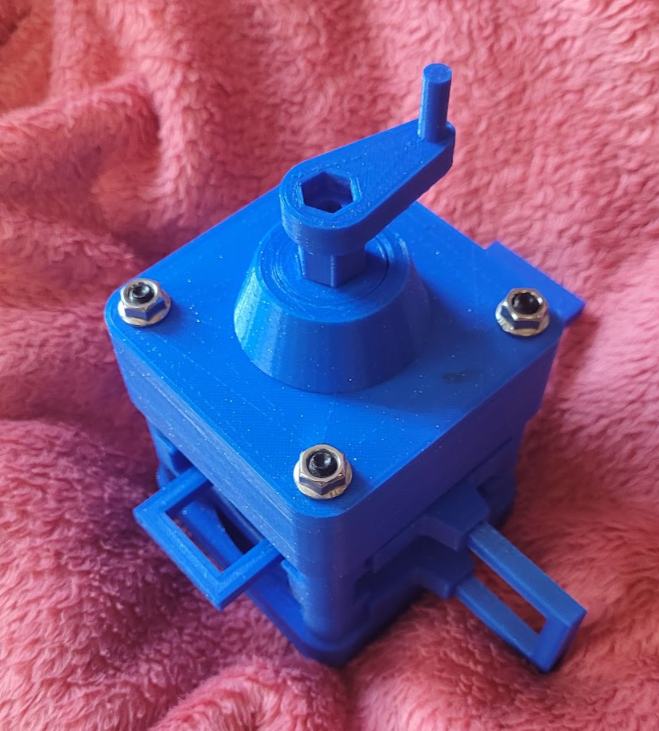

# "Crankless engine based on Sedunov design" project - Crankless Engine mechanics
An open access project made with [freecad](https://www.freecadweb.org/?lang=ru) v0.21.2 for free use (cc-by-nc-sa 4.0)

Latest updates see at [REAA forum](https://reaa.ru/threads/modelirovaniye-besshatunnogo-silovogo-mekhanizma-dvs-na-osnove-konstruktsii-sedunova-i-p.116371/post-2306584)

Video also available at RuTube:

[RuTube Video 1](https://rutube.ru/shorts/72a507d803931d1667297087fe343829/)
[RuTube Video 2](https://rutube.ru/shorts/dc9f3f0c9c413bd910ed69c0bd0e3314/)

