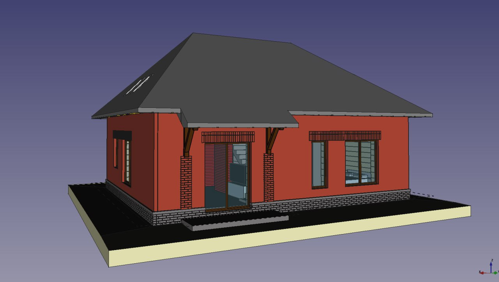
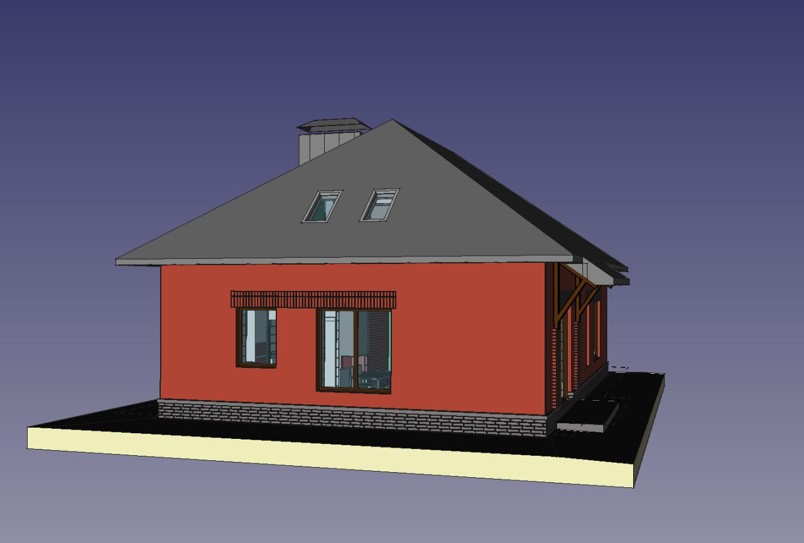
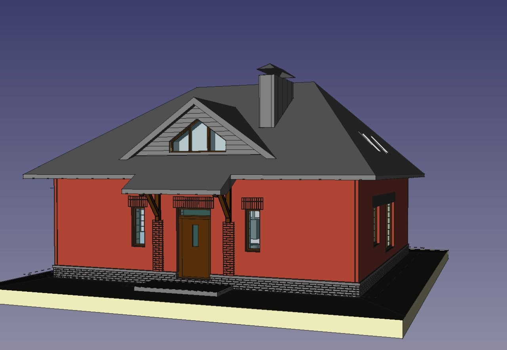
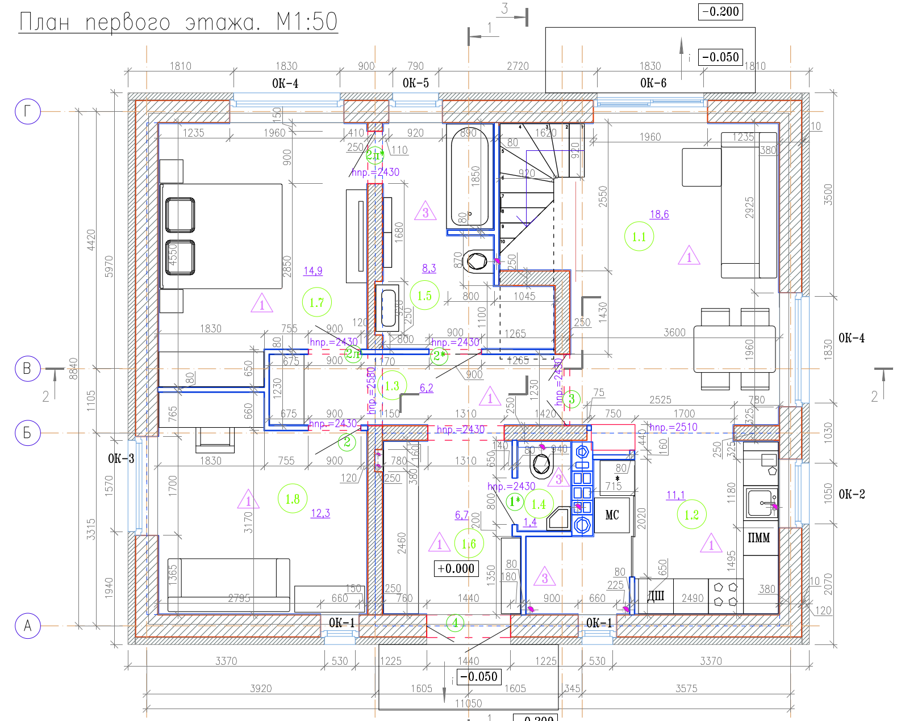
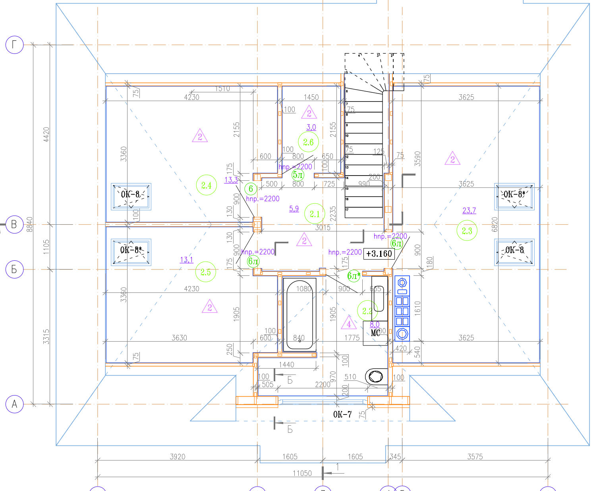
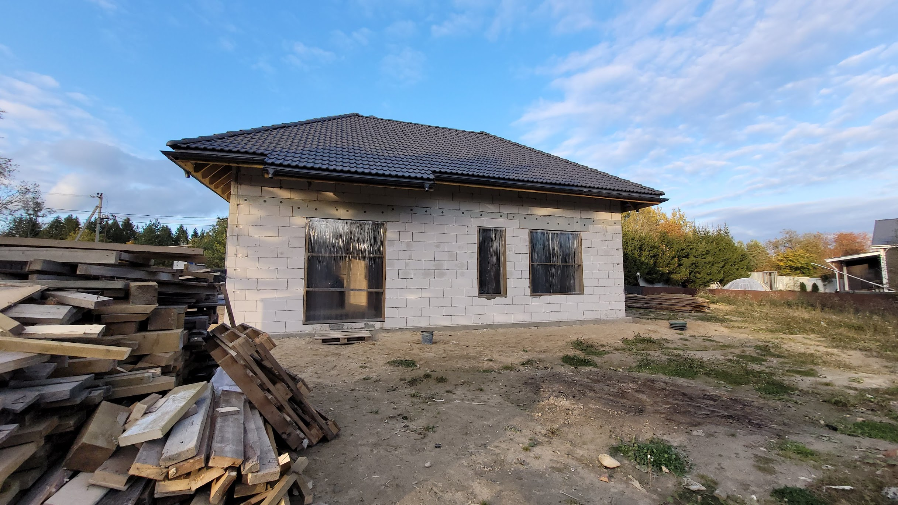
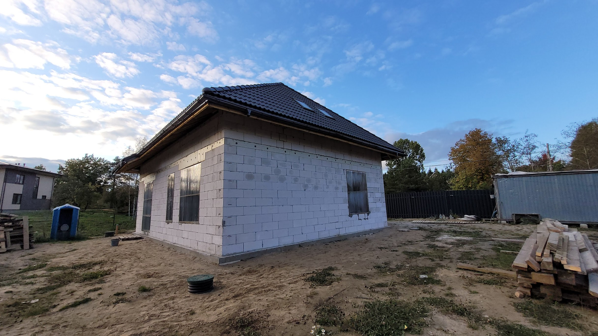
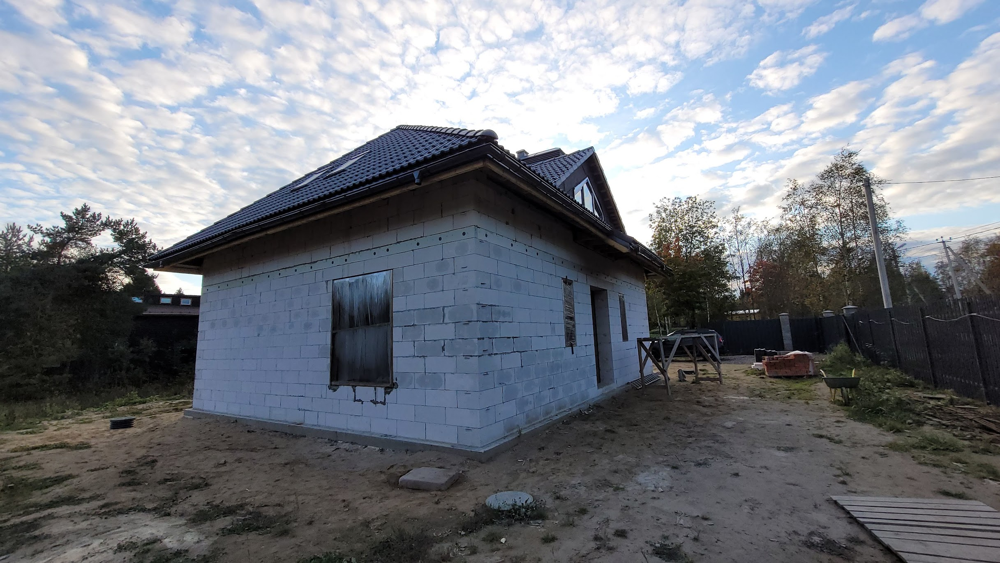
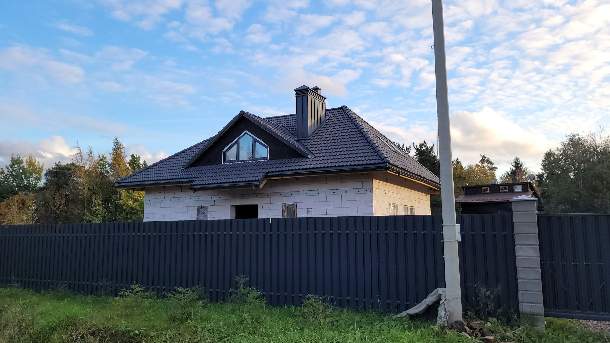

My sweet Home =) 

# 1.5 floor house (~90m2 at 1st floor)
An open access project made with [freecad](https://www.freecadweb.org/?lang=ru) v0.21 (cc-by-nc-sa 4.0)

house built from D400 400mm blocks

History of development and construstion at [forumhouse.ru](https://www.forumhouse.ru/threads/528793/)

